# BioR5 Presentation Diagrams - Mermaid Version

## 1. Reasoning Modes Overview (Slide 1)

```mermaid
graph LR
    Q1["Why does this trait exist?"] --> T1[🧬 Teleonomic]
    Q2["How does this process work?"] --> T2[⚙️ Mechanistic]
    Q3["What evolved from what?"] --> T3[🌳 Phylogenetic]
    Q4["What happens over time?"] --> T4[⏰ Temporal]

    style T1 fill:#e1f5fe
    style T2 fill:#f3e5f5
    style T3 fill:#e8f5e8
    style T4 fill:#fff3e0
```

## 2. Current AI vs BioR5 Comparison (Slide 2)

## 3. Reasoning Mode to Architecture Mapping (Slide 3 Optional)

```mermaid
graph TD
    RM[Reasoning Mode] --> D1[Parametric Memory]
    RM --> D2[Specialized Models]
    RM --> D3[External Resources]

    D1 --> D1A[✓ General principles]
    D1 --> D1B[✗ Dynamic details]

    D2 --> D2A[Image analysis]
    D2 --> D2B[Structure prediction]

    D3 --> D3A[Growing databases]
    D3 --> D3B[Simulations]

    style D1 fill:#e3f2fd
    style D2 fill:#f1f8e9
    style D3 fill:#fce4ec
```

## 4. Three-Layer Architecture Core Diagram (Slide 3 Core)

```mermaid
graph TB
    subgraph "BioR5 Architecture"
        RM[🧠 Reasoning Mode] --> C[🎯 Coordinator]

        C --> A[Layer A: The Generalist]
        C --> B[Layer B: The Specialists]
        C --> CC[Layer C: The Library]

        subgraph "Layer A"
            A1[LLM + Specialized Prompts]
            A2[Parametric Memory Tools]
        end

        subgraph "Layer B"
            B1[Protein Structure Models]
            B2[Image Analysis Models]
            B3[Sequence Models]
        end

        subgraph "Layer C"
            C1[📊 PubMed, NCBI]
            C2[⚙️ BLAST, Phylogenetic Tools]
            C3[🕸️ Gene Ontology, Reactome]
        end
    end

    style A fill:#e3f2fd
    style B fill:#f1f8e9
    style CC fill:#fce4ec
    style RM fill:#fff3e0
```

## 5. Reasoning Trace Diagram (Slide 4 Future Work)

## 6. Scalability Architecture Diagram (Optional)

## Usage Instructions

1. **Copy the corresponding Mermaid code** into your presentation tool
2. **Online preview**: Use [Mermaid Live Editor](https://mermaid.live/) to preview effects
3. **Export images**: Most Mermaid tools support exporting to PNG/SVG format
4. **Marp integration**: If using Marp, you can directly embed these diagrams in markdown

## Recommended Diagram Usage

**Core Presentation (8 minutes)**:

- Diagram 1: Reasoning Modes Overview
- Diagram 4: Three-Layer Architecture Core Diagram
- Diagram 5: Reasoning Trace Diagram

**Optional Supplements**:

- Diagram 2: Current AI vs BioR5 Comparison
- Diagram 3: Reasoning Mode Mapping
- Diagram 6: Scalability Architecture
