```mermaid
graph LR
    Q1["Why does this trait exist?"] --> T1[🧬 Teleonomic]
    Q2["How does this process work?"] --> T2[⚙️ Mechanistic]
    Q3["What evolved from what?"] --> T3[🌳 Phylogenetic]
    Q4["What happens over time?"] --> T4[⏰ Temporal]

    style T1 fill:#e1f5fe
    style T2 fill:#f3e5f5
    style T3 fill:#e8f5e8
    style T4 fill:#fff3e0
```

```mermaid
graph TD
    RM[Reasoning Mode] --> D1[Parametric Memory]
    RM --> D2[Specialized Models]
    RM --> D3[External Resources]

    D1 --> D1A[✓ General principles]
    D1 --> D1B[✗ Dynamic details]

    D2 --> D2A[Image analysis]
    D2 --> D2B[Structure prediction]

    D3 --> D3A[Growing databases]
    D3 --> D3B[Simulations]

    style D1 fill:#e3f2fd
    style D2 fill:#f1f8e9
    style D3 fill:#fce4ec
```

```mermaid
graph TB
    subgraph "BioR5 Architecture"
        RM[🧠 Reasoning Mode] --> C[🎯 Coordinator]

        C --> A[Layer A: The Generalist]
        C --> B[Layer B: The Specialists]
        C --> CC[Layer C: The Library]

        subgraph "Layer A"
            A1[LLM + Specialized Prompts]
            A2[Parametric Memory Tools]
        end

        subgraph "Layer B"
            B1[Protein Structure Models]
            B2[Image Analysis Models]
            B3[Sequence Models]
        end

        subgraph "Layer C"
            C1[📊 PubMed, NCBI]
            C2[⚙️ BLAST, Phylogenetic Tools]
            C3[🕸️ Gene Ontology, Reactome]
        end
    end

    style A fill:#e3f2fd
    style B fill:#f1f8e9
    style CC fill:#fce4ec
    style RM fill:#fff3e0
```

# BioR5 Presentation Visual Resources

## Image File Mapping

| Slide                                 | Image File                         | Content Description                                                         | Usage                   |
| ------------------------------------- | ---------------------------------- | --------------------------------------------------------------------------- | ----------------------- |
| **Slide 1: The Problem**              | `reasoning_examples.png`           | Reasoning modes overview - different problem types and reasoning approaches | Core slide (required)   |
| **Slide 2: Our Solution**             | `current_model_vs_BioR5.png`       | Current AI vs BioR5 comparison diagram                                      | Core slide (required)   |
| **Slide 3: Design Challenge**         | `reasoning_mode_to_layer_arch.png` | Reasoning mode to architecture layer mapping                                | Optional slide          |
| **Slide 3: Three-Layer Architecture** | `architecture.png`                 | BioR5 three-layer architecture core diagram                                 | Core slide (required)   |
| **Slide 4: Future Work**              | `triage_planner.png`               | Reasoning trace and divide-and-conquer scheduling                           | Core slide (required)   |
| **Slide 6B: Development Boundaries**  | `team_role_and_dev_role.png`       | Team roles and development boundaries                                       | Optional detailed slide |

## Mermaid Diagram Sources

### 1. Reasoning Modes Overview (Slide 1)

### 2. Current AI vs BioR5 Comparison (Slide 2)

### 3. Reasoning Mode to Architecture Mapping (Slide 3 Optional)

### 4. Three-Layer Architecture Core Diagram (Slide 3 Core)

### 5. Reasoning Trace Diagram (Slide 4 Future Work)

### 6. Team Roles and Development Boundaries (Optional)

## 8-Minute Core Presentation Strategy

### Required Images (Core Content)

1. `reasoning_examples.png` - Problem definition
2. `current_model_vs_BioR5.png` - Solution comparison
3. `architecture.png` - Three-layer architecture
4. `triage_planner.png` - Future work

### Optional Images (Time Permitting)

5. `reasoning_mode_to_layer_arch.png` - Design challenge
6. `team_role_and_dev_role.png` - Team collaboration

## Usage Instructions

### For Static Images

- All image files are located in the `figures/` folder
- Preload all images in your presentation tool
- The core 4 images are sufficient for an 8-minute presentation
- Optional images can be used flexibly based on available time

### For Mermaid Diagrams

1. **Copy the corresponding Mermaid code** into your presentation tool
2. **Online preview**: Use [Mermaid Live Editor](https://mermaid.live/) to preview
3. **Export images**: Most Mermaid tools support PNG/SVG export
4. **Marp integration**: Direct embedding in markdown presentations

## Recommended Visual Flow

**Core Presentation (8 minutes)**:

- Diagram 1: Reasoning Modes Overview → Problem identification
- Diagram 2: Current AI vs BioR5 → Solution positioning
- Diagram 4: Three-Layer Architecture → Technical approach
- Diagram 5: Reasoning Trace → Future capabilities

**Extended Presentation (12+ minutes)**:

- Add Diagram 3: Architecture mapping details
- Add Diagram 6: Team collaboration model
