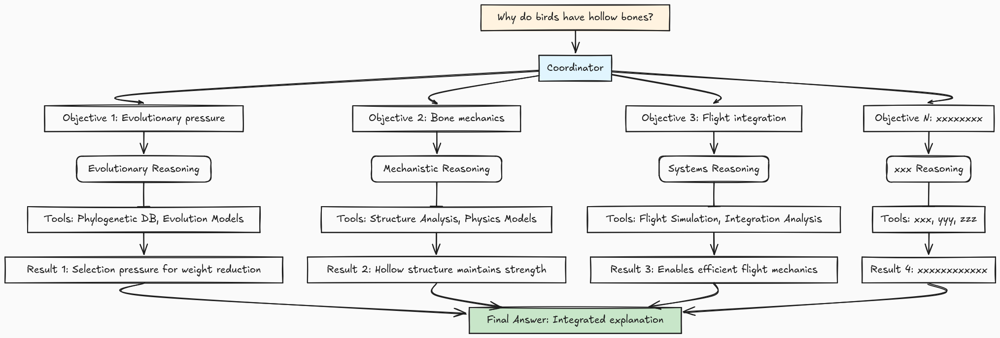

<!-- _class: lead -->

# BioR5: Biological Reasoning System

## A Three-Layer Tool-Calling Architecture

**Peng Ding**
Argonne National Laboratory
University of Chicago

---

## The Problem

**The challenge**: Biologists use **different reasoning modes**

- **"Why does this trait exist?"** → Teleonomic
- **"How does this work?"** → Mechanistic

**Current AI**: One model, one approach
**Biology**: Eleven distinct reasoning modes

---

## Our Solution

**BioR5**: Different questions → Different approaches
**Current AI**: "More data + bigger model"

**Example**: "How does insulin regulate glucose?"

- Needs biochemical pathways + causal networks
- NOT just correlation in expression data

---

## Three-Layer Architecture

**BioR5**: Map reasoning modes to computational layers

**Layer A**: LLM + specialized prompts
**Layer B**: Specialized models (proteins, images)  
**Layer C**: External resources (databases, tools)

---

## Reasoning Mode Details - A Receipe

**Key Insight**: Each reasoning mode needs different resources:

1. **Model weights**: Principles ✓, Details ✗
2. **Specialized models**: Images, structures, etc.
3. **External**: Databases, simulations, etc.

---

## Layer Details - ToolRegistries

**Layer A**: `parametric_memory`= LLM + specialized prompts

- Same LLM, different prompts → Different knowledge distillation
- Status: 11 reasoning modes implemented

**Layer B**: Specialized models as tools

- Structure prediction, image analysis
- Packaged as callable tools

**Layer C**: External resources

- Databases, computational tools, knowledge graphs

---

## Working in Progress

**Next**: Divide-and-conquer scheduling

**Example**: 'bird bone evolution' →

- Evolutionary pressure
- Bone mechanics
- Flight integration

Results merge into final answer

---

## Why This Matters

**Scalability**:

- ToolRegistry: Any OpenAPI/MCP/Python function becomes a tool
- ReasoningModeRegistry: Recipes for reasoning

**Team boundaries**:

- AI developers: Framework
- Domain experts: Reasoning modes
- Tool developers: Components

---

<!-- _class: lead -->

# Thank You

## **Questions?**
