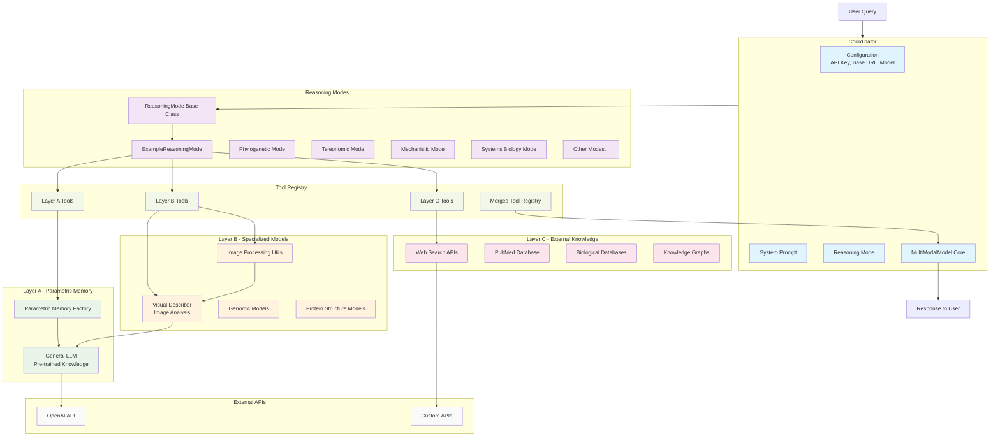

# Biological Reasoning System Architecture

## Architecture Overview

### Core Components

1. **Coordinator**: The main orchestrator that manages the entire system
   - Handles configuration (API keys, base URLs, model names)
   - Manages reasoning modes and system prompts
   - Coordinates between layers and tools

2. **Reasoning Modes**: Define specific approaches to biological reasoning
   - Base class provides common functionality
   - Example mode demonstrates the framework
   - Specialized modes for different biological reasoning types

3. **Three-Layer Architecture**:
   - **Layer A**: Parametric memory using general LLM knowledge
   - **Layer B**: Specialized models for multimodal data (images, sequences, structures)
   - **Layer C**: External knowledge sources (APIs, databases, knowledge graphs)

4. **Tool Registry**: Manages and organizes tools from all layers
   - Individual registries for each layer
   - Merged registry for unified access
   - Tool selection and execution handling

### Data Flow

1. User submits a query to the Coordinator
2. Coordinator determines appropriate reasoning mode
3. Reasoning mode provides system prompt and available tools
4. Tools from all layers are merged into a single registry
5. MultiModalModel core processes the query using available tools
6. Response is returned to the user

### Key Features

- **Modular Design**: Each layer can be developed independently
- **Extensible**: New reasoning modes and tools can be easily added
- **Flexible**: Different combinations of tools can be used for different tasks
- **Scalable**: External APIs and databases provide access to vast knowledge sources 